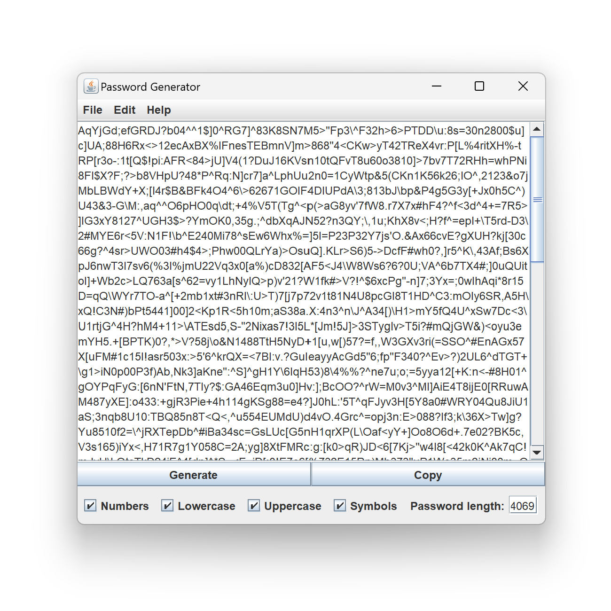

# PassGen

<h2>An Password Generator Java - Swing</h2>

Created with <a href="https://www.jetbrains.com/idea/">IntelliJ</a>.

<h2>About:</h2>

<b>Author: </b><a href="https://github.com/bill-chamal">Bill Chamalidis</a> University of Macedonia

Created: 1 Feb 2023

Version: 0.0.1

<h2>license:</h2>

This program is free software: you can redistribute it and/or modify it under the terms of the <a href="https://www.gnu.org/licenses/gpl-3.0.en.html">GNU</a> General Public License as published by the Free Software Foundation, either version 3 of the License, or any later version.

